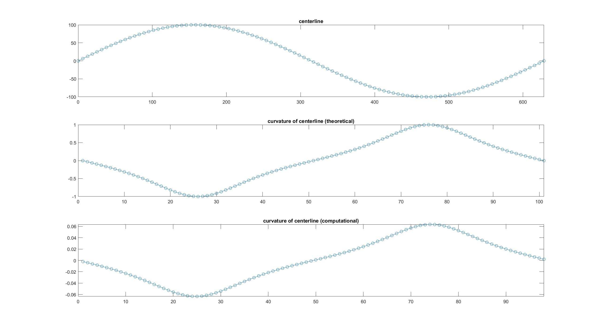

# Calculate_the_Curvature_of_a_Centerline
Calculate the Curvature of a Centerline of C. elegans

# Result

## Smoothing and Interpolation

Below, the left panels are the original centerlines, the middle panels are smoothed centerlines, and the right panels are interpolated smoothed centerlines.

## Calculating the Curvature

A perfect sinusoidal curve is generated to test these codes.

